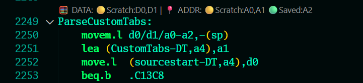
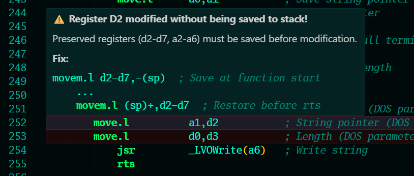

# M68K Register Tracker

Live register usage analysis for Motorola 68000 assembly. Detects register preservation violations according to standard M68K calling conventions.

## What it does

Shows color-coded register status above each subroutine and highlights lines where preserved registers (d2-d7, a2-a6) are modified without being saved to stack.

More info on hover:

## Features

- Multi-line CodeLens above subroutines showing data and address register usage
- Color indicators: yellow (scratch), green (saved), red (unsafe)
- Inline warnings on problematic lines with hover tooltip showing fix examples
- Red marker in overview ruler for quick navigation to issues

## Installation

1. Copy folder to `~/.vscode/extensions/m68k-register-tracker/` or %USERPROFILE%\.vscode on Windows
2. Reload VSCode (Ctrl+Shift+P -> "Developer: Reload Window")
3. Open any `.s` or `.asm` file

## Requirements

- VSCode 1.60.0 or higher
- [Amiga Assembly extension](https://github.com/prb28/vscode-amiga-assembly) (prb28.amiga-assembly)

## License

GPL-3.0 - This extension is designed for use with the Amiga Assembly extension which is licensed under GPL-3.0.
